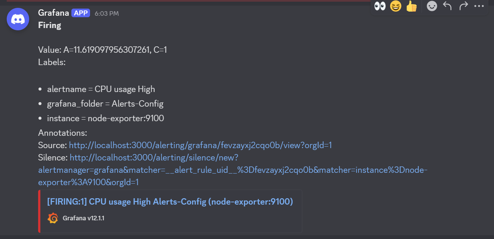
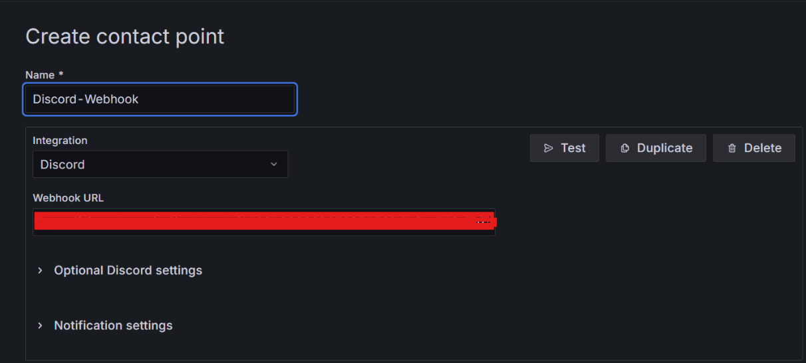

# 📊 Monitoring Project using Grafana and Prometheus

A monitoring stack built with **Prometheus** and **Grafana**, containerized using **Docker Compose**.  
It monitors a **Node.js application** and **system metrics**, provides interactive dashboards, and integrates alerting via **Discord**.  

The entire solution was deployed on a **DigitalOcean Droplet**, demonstrating full setup of a production-like monitoring environment on a cloud server.  

The Grafana dashboards and alert rules were created and customized manually in the Grafana UI.  

📚 For more details on dashboard configuration, check [Grafana's official docs](https://grafana.com/docs/).

---

## ✨ Features 

- **Prometheus** scrapes metrics from a Node.js app and the host (node-exporter).  
- **Grafana** dashboards & alerts fully designed in the Grafana UI.  
- **Alerting system** integrated with Discord webhooks.  
- **Docker Compose** for one-command deployment and teardown.  

---

## 🛠️ Setup Steps
### 🔹 Step 1 — Start the monitoring stack
Run the following command to start all services in the background:

```bash
docker compose up -d
```
### 🔹 Step 2 — Access the services
- **Node.js App** → [http://localhost:3000](http://localhost:3000)
  
- **Prometheus** → [http://localhost:9090](http://localhost:9090)
- **Grafana** → [http://localhost:3001](http://localhost:3001)  
  *(login: `admin / admin`)*

## 🚀 Components Overview

### 1) Node.js Application (metrics-enabled)
- A simple landing page exposed on port `3000`  
- `/metrics` endpoint for Prometheus scraping  

### 2) Prometheus (scrape targets)
Prometheus scrapes:  
- `node-exporter:9100` → system metrics  
- `app:3000/metrics` → Node.js app metrics  

### 3) Grafana (dashboards & alerts UI)
The Grafana dashboards and alerts were created **manually in the Grafana UI**.  
Custom panels include:
- CPU usage  
- Memory usage  
- Server errors  
- Inbound / Outbound traffic  
- Total number of requests  

---

## 🔔 Alerting (Grafana → Discord)

### A) Create/verify an alert rule
Example: **CPU usage high alert** configured under *Alerts-Config*.  

### B) Configure Discord contact point
1. Go to **Alerting → Contact points**  
2. Add a new contact point → Select **Discord**  
3. Paste your webhook URL  

### C) Receive alerts in Discord
When thresholds are breached, Grafana sends an alert to your configured **Discord channel**.


## 🧭 How it Works (Flow)

1. **Prometheus** scrapes metrics from the Node.js app and node-exporter.  
2. **Grafana** queries Prometheus and renders dashboards.  
3. Custom **Grafana UI dashboards & alerts** visualize and evaluate metrics.  
4. On threshold breach, **Grafana sends alert notifications to Discord**.  

---

## 🛠️ Troubleshooting

- **Services not reachable?**  
  → Check firewall ports and container health.  

- **No data in dashboards?**  
  → Verify Prometheus targets page and scrape jobs configuration.  

- **No Discord alerts?**  
  → Test the contact point in Grafana and check webhook permissions.
  

